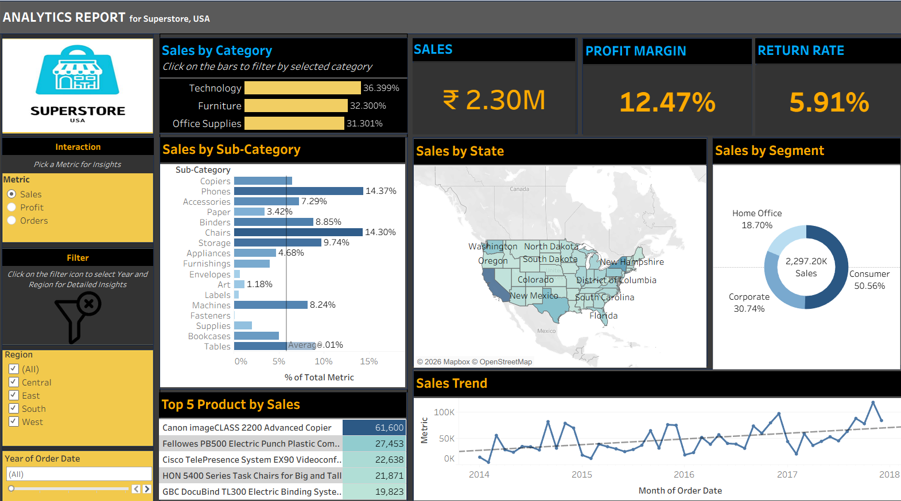
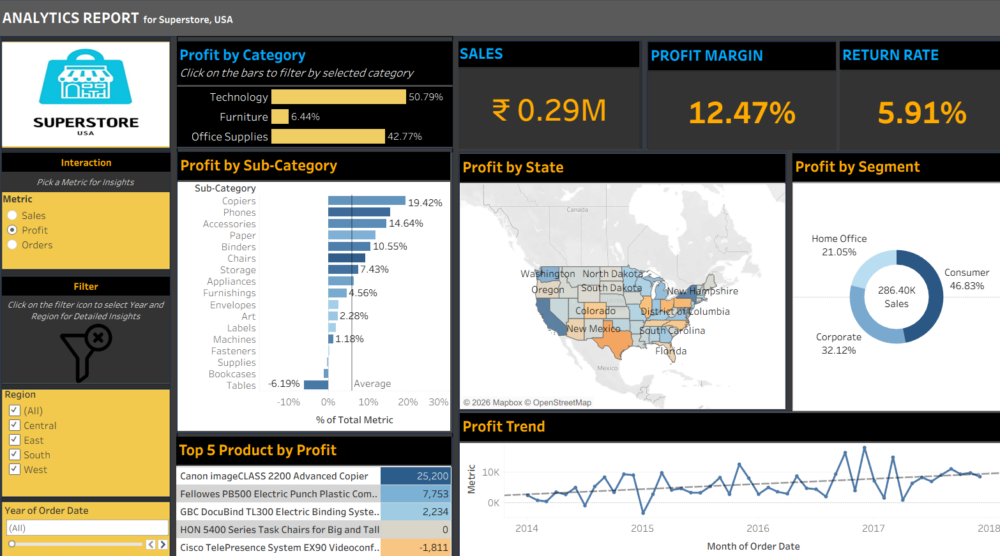

# Superstore Tableau Dashboard

Interactive Tableau dashboard analysing sales, profit, and business performance across regions, product categories, and customer segments using the Superstore dataset.

## Dashboard Preview

### Sales Dashboard

### Profit Dashboard

### Category_wise_filter [Office Supplies]
![Category_wise_filter].(Screenshots/CategoryOfficeSupplies_Filter.png.png).

## Project Overview

This project uses Tableau to analyse Superstore USA data and present business insights through interactive visualizations.

## Key Features

- **Sales Analysis:** Sales by category, sub-category, state, and customer segment.
- **Profit Analysis:** Profitability by category, sub-category, state, and segment.
- **Key Performance Indicators:** Sales, profit margin, and return rate.
- **Top 5 Products:** Identify leading products by sales and profit.
- **Trend Analysis:** Monthly sales and profit trends.
- **Interactive Filters:** Explore metrics by region and order year.

## Tools Used

- Tableau
- Data Visualization
- Business Intelligence
- Sales and Profit Analysis

## How to View

1. Download `Superstore_Tableau_Dashboard.twbx` from this repository.
2. Open the file using Tableau Desktop.
3. Select Sales, Profit, or Orders and use the filters to explore the data.

## Author

**Pratik Khande**

GitHub: [pratikkhande](https://github.com/pratikkhande)
